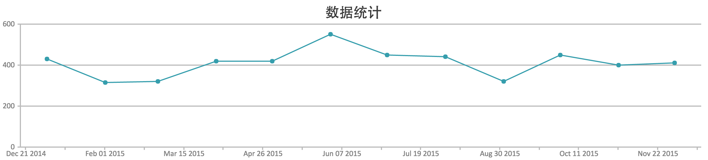
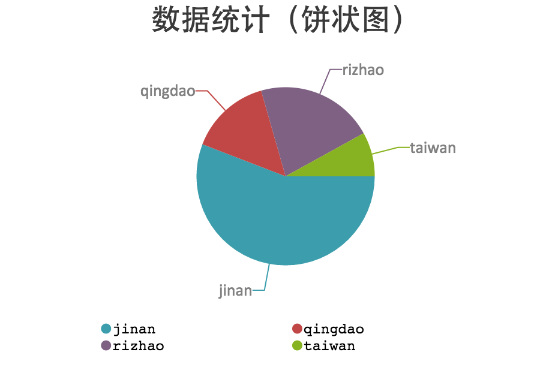
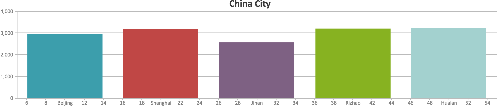

#统计图表（Chart）

&emsp;&emsp; Chartkick是一个图表绘制工具，特点是UI美观、使用简单，并且支持IE6在内的大多数浏览器。只需要一行Ruby代码即可绘制出漂亮的图表。

## 使用Chartkick

1.**在Gemfile中添加chartkick和groupdate**

```
gem "chartkick"
gem "groupdate"
```

2.**引用表格处理js**

>使用Google Charts，则添加代码：

>```
<%= javascript_include_tag "//www.google.com/jsapi", "chartkick" %>
>```
使用HighCharts，下载[HightCharts](http://www.highcharts.com/download)后添加代码：

>```
<%= javascript_include_tag "your_path/highcharts.js", "chartkick" %>
>```

3.**添加chartkick.js**
>- Rails版本为3.1+时，不需要引用chartkick.js
>- Rails版本为2.3和3.0时，必须下载使用[chartkick.js](https://raw.githubusercontent.com/ankane/chartkick/master/app/assets/javascripts/chartkick.js),并且Rails2.3时必须添加以下代码：
>```
><script src="//www.google.com/jsapi"></script>
>```

##绘制线形图

例如：

>```
><%= line_chart User.group_by_day(:created_at).count %>
>```

## 绘制饼状图

例如：

>```
><%= pie_chart Goal.group("name").count %>
>```

## 绘制柱状图

例如：

>```
><%= column_chart Task.group_by_day_of_week(:created_at).count %>
>```


## 多重线图

例如：

>```
><%= line_chart @goals.map{|goal|
  {:name => goal.name, :data => goal.feats.group_by_week(:created_at).count }
} %>
>```


